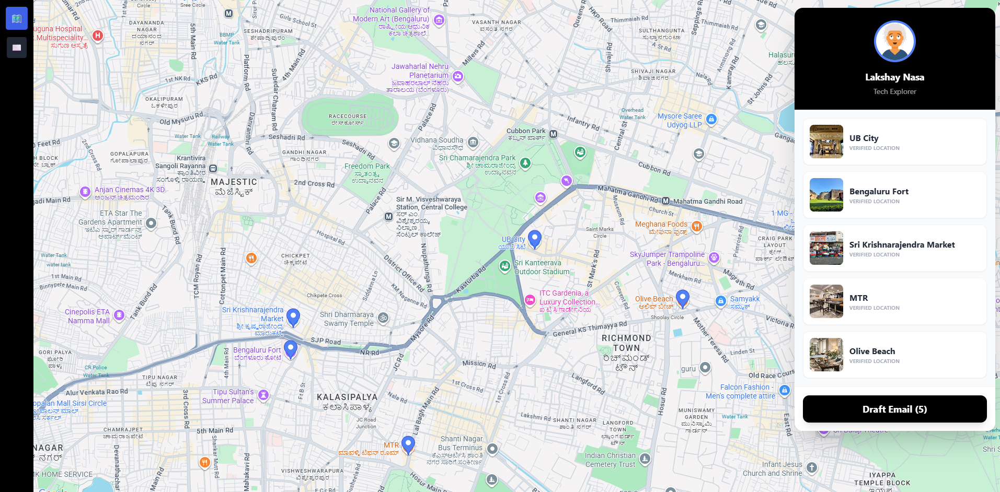
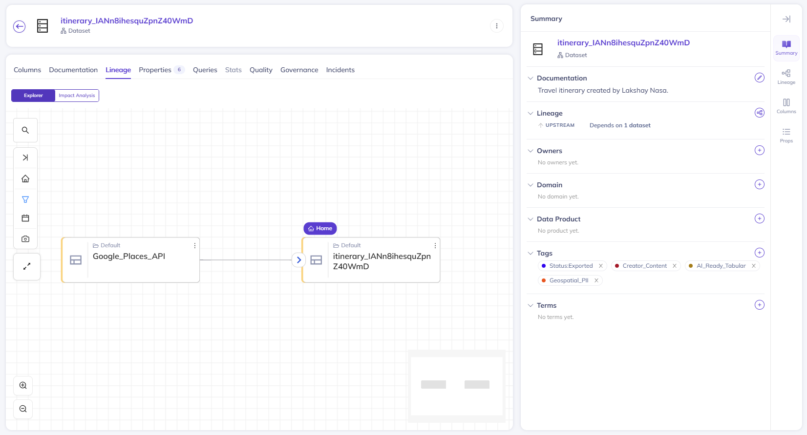

# City Scout 🗺️

**From Map Pins to Professional Itineraries.**

City Scout is a full-stack application designed for travel influencers to transform map-based location selections into professional, production-ready email itineraries. 

Beyond the user interface, I integrated **DataHub** to maintain data lineage, providing clear visibility into how location data is processed from ingestion to the final output.

## 🚀 The Problem
Travel creators often struggle to bridge the gap between "saving a spot on a map" and "sharing a structured guide with followers." Manually copying addresses, finding photos, and formatting emails is a tedious, disconnected process.

## 💡 The Solution
City Scout streamlines this workflow:
1.  **Discover**: Search and pin locations visually using the Google Maps interface.
2.  **Draft**: Automatically syncs location metadata to a persistent backend.
3.  **Export**: Generates a beautiful, responsive HTML email ready for newsletters or client delivery.

## 📸 Project Demo

### 1. The Creator Experience (Frontend)
Users select locations on the interactive map. When they click **"Draft Email,"** the application triggers an immediate metadata event.
 

### 2. The Data Observability (DataHub)
Behind the scenes, the **Metadata Watcher** captures this event, creating a lineage graph that traces the data from the **Google Places API** to our **Firestore** production database.


## 🛠️ Tech Stack

**Frontend & UI**
* React (Vite) + TypeScript
* Tailwind CSS
* Google Maps JavaScript API
* Unlayer

**Backend & Data**
* **Firebase Firestore**: Real-time NoSQL database for managing Draft/Export states.
* **Python**: Custom metadata watchers for data governance.

**Data Engineering & Governance**
* **DataHub**: Implemented for end-to-end observability.
    * **Automated Lineage**: Tracks data provenance from `Google_Places_API` → `Firestore_Itinerary`.
    * **Lifecycle Tracking**: Monitors the state transition of assets from `Status:Draft` to `Status:Exported`.

## ⚙️ Getting Started

This project requires API keys for Google Maps, Firebase, and Unlayer.

1.  **Clone the repository**
    ```bash
    git clone [https://github.com/lakshay-nasa/city-scout.git](https://github.com/lakshay-nasa/city-scout.git)
    cd city-scout
    ```

2.  **Configure Environment**
    Rename the example file and add your credentials:
    ```bash
    cp .env.example .env
    ```

3.  **Install & Run**
    ```bash
    npm install
    npm run dev
    ```

4.  **Run Metadata Watcher (Optional)**
    To see the DataHub integration in action, ensure you have a local GMS instance running and a valid `service_account.json` for Firebase.
    ```bash
    python watch_and_push.py
    ```

---
*Built by Lakshay Nasa. This is a beta project currently in active development.*